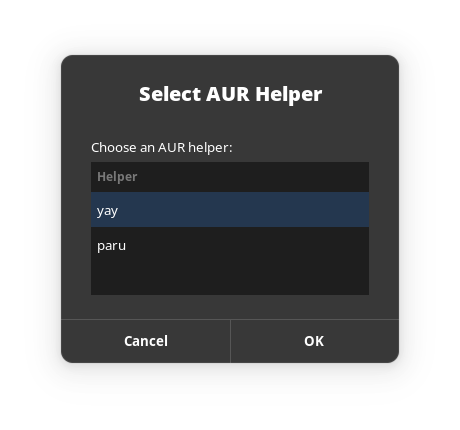
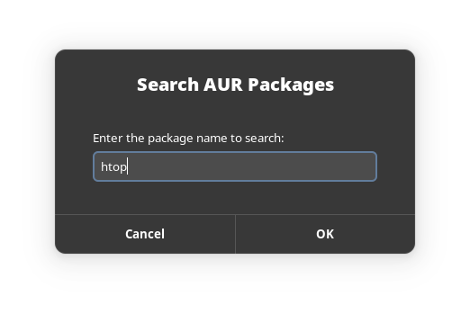
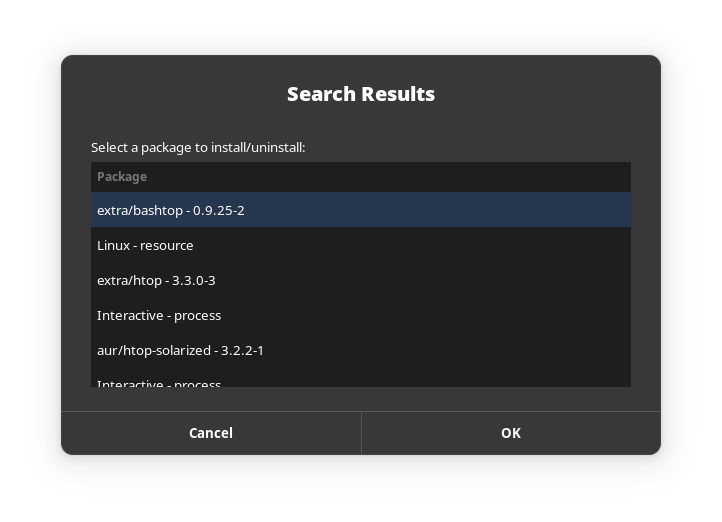
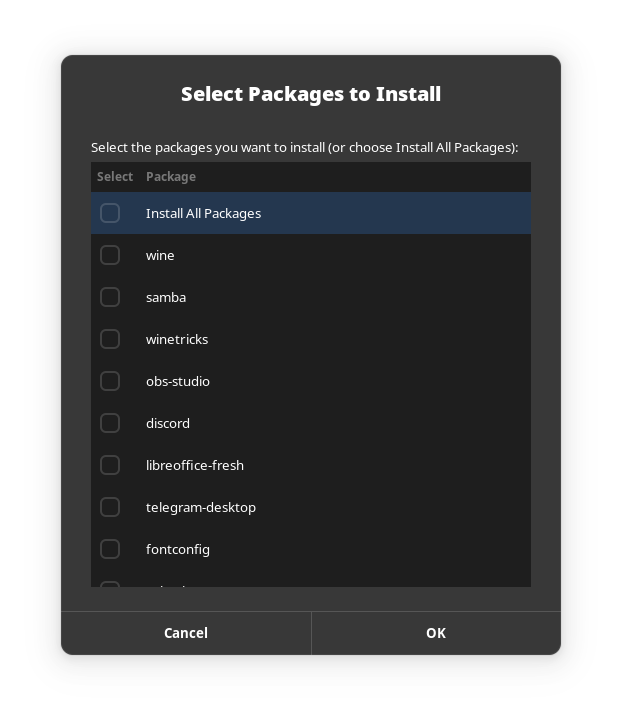

#### Post Install Arch Quick Install Script.

### For (aur.sh)

A graphical tool for AUR that uses zenity.




#### How it works

- Prompts users to choose between yay or paru.
- Checks if the specified AUR helper is installed. If not, it will install it.
- Provides a search box for users to search for packages.
- Displays a list of packages found.
- After selecting a package, it prompts for installation or uninstallation and asks for the sudo user password.

#### How to set up

1. Clone the project.
2. Give execute permissions to the script by running the following command:
```bash
chmod +x aur.sh
```
3. Run the script:
```bash
./aur.sh
```

### For (install2.sh)

A graphical tool for managing my personal install script.



#### How it works

- Shows my personal packages install list.
- Allows users to select which packages to install or use the "install all" feature.

#### How to set up

1. Clone the project.
2. Give execute permissions to the script by running the following command:
```bash
chmod +x install2.sh
```
3. Run the script:
```bash
./install2.sh
```

